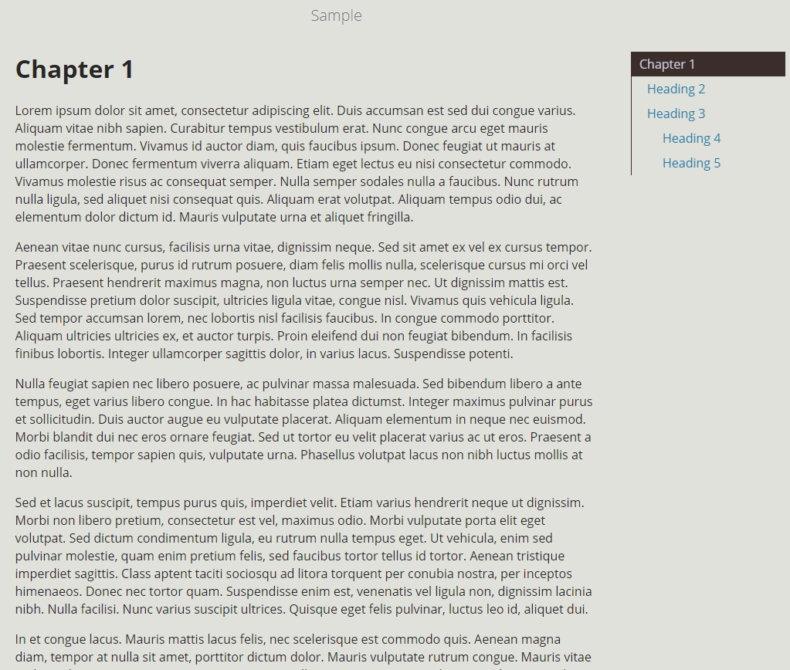

# mdBook-pagetoc
A page table of contents for mdBook

## What is this?

On 23rd June, I opened an issue for [mdBook](https://github.com/rust-lang/mdBook) to add a table of contents for individual pages [here](https://github.com/rust-lang/mdBook/issues/1263). After some time, I noticed that there had been no response to the issue and decided to do something about it.

I don't know Rust and have very little experience in web development, but could not stand to not have this features any longer.

A sample of it in action can be viewed [here](https://www.jorel.dev/mdBook-pagetoc/).



-----

## How do I use it?

My very clunky solution consists of 3 files:

- `sidebar.js`, which handles the scrolling and clicking for the table of contents

- `style.css` which handles the styling

- `theme/index.hbs`, which adds the following lines:

  ```html
  <main>
      <!-- Page table of contents -->
      <div class="sidetoc"><nav class="pagetoc"></nav></div>
  
      {{{ content }}}
  </main>
  ```

Simply include these changes in your own mdBook, and add the following to your `book.toml` file:

```toml
[output.html]
additional-css = ["style.css"]
additional-js = ["sidebar.js"]
```

If you're still stuck, don't worry - this entire repository is an example of it working in action!

-----

## Acknowledgements

- This answer on [Stack Overflow](https://stackoverflow.com/a/54994316/4779071) which has code for handling automatic highlighting for sidebar elements
- [You might not need jquery](http://youmightnotneedjquery.com/), which I used to de-jQuery the code from that Stack Overflow answer
